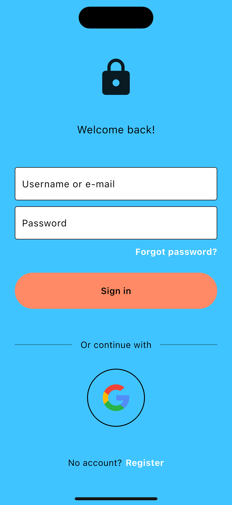
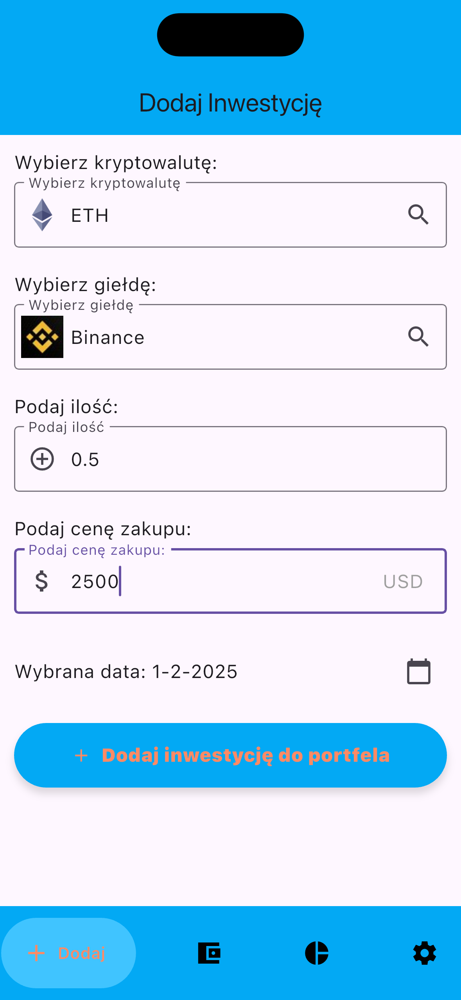
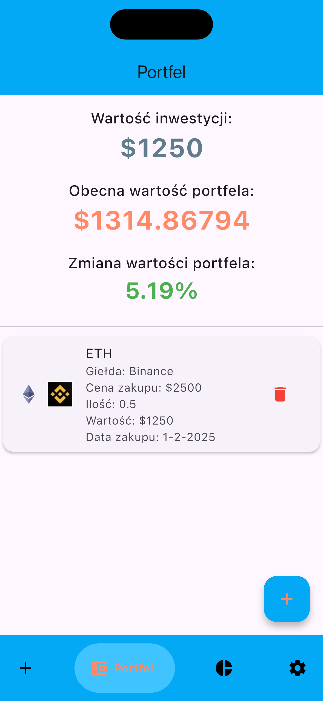
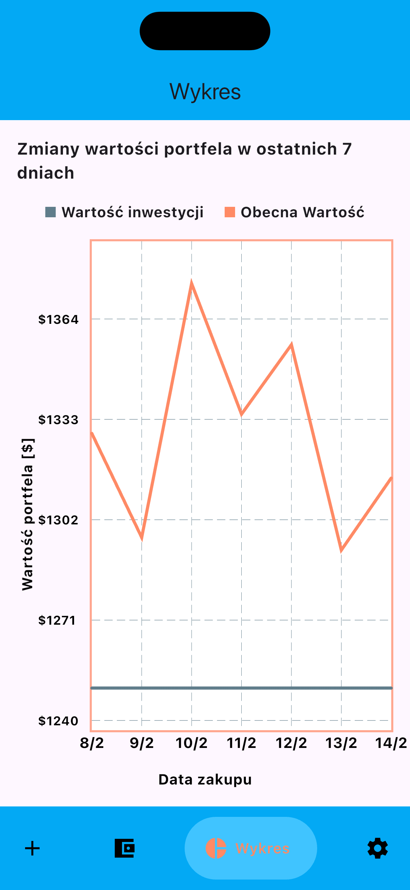
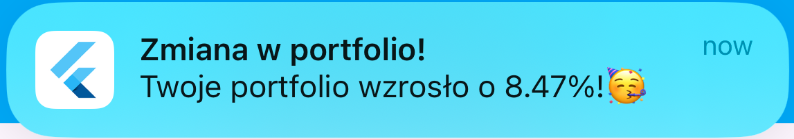

# 📈 AssetWallet – Cryptocurrency Portfolio Management App

**AssetWallet** is a mobile application designed for managing your cryptocurrency investment portfolio. It allows users to track asset values, analyze price changes, and receive alerts for significant portfolio value shifts.

---

## ✨ Key Features

- 🔐 **User Registration and Login** via Firebase Authentication  
- 📊 **Real-time Portfolio Value Monitoring** using the CoinGecko API  
- 🔔 **Local Push Notifications** when the portfolio value changes beyond a specified threshold (default ±5%)  
- 📈 **Data Visualization** – Interactive chart displaying portfolio value history  
- 📉 **Historical Analysis** – Fetching and analyzing historical data via CoinGecko API  
- 💾 **Data Storage** – Investment data synchronization and storage in Firebase Firestore  

---


## 🖼️ Screenshots

### 🔐 Login & Registration Screen  
Users can log in using their email and password or authenticate via Google.  


---

### 📊 Investment Entry Screen  
Users can add an investment by specifying the cryptocurrency, exchange, purchase price, amount, and date.  


---

### 📊 Portfolio Value Monitoring  
View of the portfolio after adding investments – shows current value and historical changes.  


---

### 📈 Portfolio Value Change Analysis  
The app includes a chart displaying changes in portfolio value over time.  


---

### 🔔 Value Change Notifications  
When the portfolio value changes by more than 5%, the user receives a local push notification.  


---


## 🛠 Technologies

The project was built using the following technologies:

| Layer           | Technology               |
|----------------|--------------------------|
| **Frontend**    | Flutter                  |
| **Backend**     | Django                   |
| **Database**    | Firebase Firestore       |
| **Authentication** | Firebase Authentication |
| **Market Data** | CoinGecko API            |

---

## 🚀 Getting Started


### **1️⃣ Clone the repository**
```sh
git clone https://github.com/Cz-Oscar/AssetWallet.git
cd AssetWallet
```
### 2️⃣ **Install dependencies**
📱 Flutter
```sh
flutter pub get
```
🖥 Backend Django
```
cd crypto_backend
pip install -r requirements.txt
```
### 3️⃣ **Run the application**
📱 Flutter
```
flutter run
```
🖥 Backend Django
```
cd crypto_backend
python3 manage.py runserver
```
🖥 Start the portfolio value updater (required for notifications):
```
cd crypto_backend/investments
python3 update_crypto_data.py
```
Author
👤 **Oscar Czempiel**  
- [LinkedIn](https://www.linkedin.com/in/oscar-czempiel/)
- [GitHub](https://github.com/Cz-Oscar)
